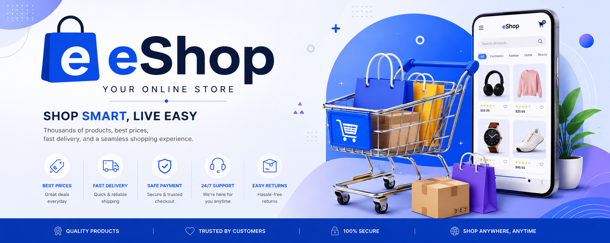

# 🛒 eShop

<div align="center">



**A modern and lightweight online shopping platform built with HTML, CSS, and JavaScript.**


</div>

---

## ✨ Features

* 🛍️ Browse products
* 🔍 Search products
* 🛒 Shopping cart system
* ❤️ Wishlist support
* 👤 User authentication
* 📦 Order management
* 💳 Online payment integration
* 🌙 Dark mode
* 📱 Responsive design

---

## 📸 Screenshots

### Home Page

```text
Coming Soon...
```

### Product Page

```text
Coming Soon...
```

### Shopping Cart

```text
Coming Soon...
```

---

## 📂 Project Structure

```text
eShop/
│
├── index.html
├── products.html
├── cart.html
├── login.html
├── admin.html
│
├── css/
│   ├── style.css
│   └── admin.css
│
├── js/
│   ├── app.js
│   ├── products.js
│   ├── cart.js
│   ├── auth.js
│   └── admin.js
│
├── assets/
│   ├── images/
│   └── icons/
│
└── README.md
```

---

## 🚀 Getting Started

### Clone the Repository

```bash
git clone https://github.com/yourusername/eShop.git
```

### Open the Project

```bash
cd eShop
```

### Run Locally

Use:

* Live Server (VS Code)
* XAMPP
* Any local web server

Then open:

```text
http://localhost:5500
```

---

## 🛠️ Built With

* HTML5
* CSS3
* JavaScript (ES6+)

Future plans:

* Firebase Authentication
* Firebase Firestore
* Stripe / VNPay Payments
* Progressive Web App (PWA)

---

## 🗺️ Roadmap

### Version 0.1

* [x] Project setup
* [x] Homepage
* [ ] Product page
* [ ] Cart system

### Version 0.5

* [ ] Product search
* [ ] User accounts
* [ ] Wishlist

### Version 1.0

* [ ] Admin dashboard
* [ ] Online payments
* [ ] Order tracking
* [ ] Mobile optimization

---

## 🤝 Contributing

Contributions, issues, and feature requests are welcome!

Feel free to fork the repository and submit a pull request.

---

## 📜 License

This project is licensed under the MIT License.

---

<div align="center">

Made with ❤️ by the eShop Team

</div>
